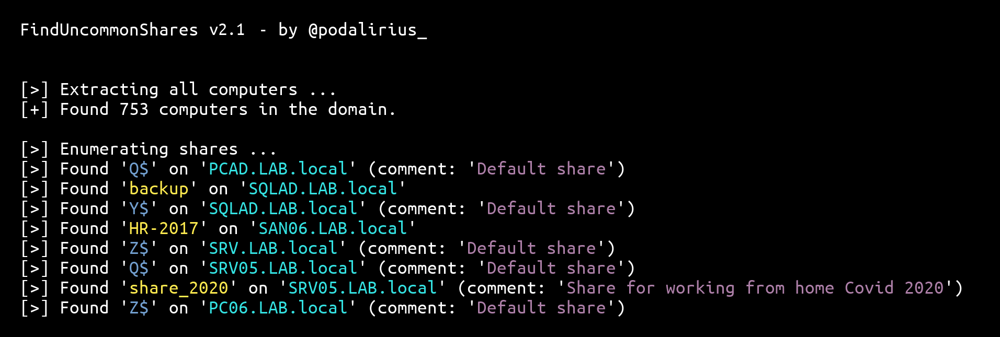
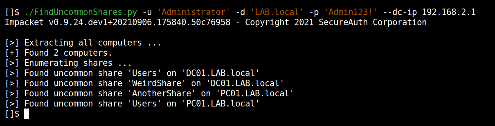

# FindUncommonShares

<p align="center">
    The script <a href="https://github.com/p0dalirius/FindUncommonShares/blob/main/FindUncommonShares.py">FindUncommonShares.py</a> is a Python equivalent of <a href="https://github.com/darkoperator/Veil-PowerView/">PowerView</a>'s <a href="https://github.com/darkoperator/Veil-PowerView/blob/master/PowerView/functions/Invoke-ShareFinder.ps1">Invoke-ShareFinder.ps1</a> allowing to quickly find uncommon shares in vast Windows Active Directory Domains.
    <br>
    
    <a href="https://twitter.com/intent/follow?screen_name=podalirius_" title="Follow"></a>
    <br>
</p>





## Features

 - [x] Only requires a **low privileges domain user account**.
 - [x] Automatically gets the list of all computers from the domain controller's LDAP.
 - [x] Ignore the hidden shares (ending with `$`) with `--ignore-hidden-shares`.
 - [x] Multithreaded search.
 - [x] JSON export of the found shares, with IP, name, comment, flags and UNC path.

## Usage

```              
$ ./FindUncommonShares.py -h
FindUncommonShares v2.0 - by @podalirius_

usage: FindUncommonShares.py [-h] [-ts] [--use-ldaps] [-q] [-debug] [-no-colors] [-I] [-t THREADS] [-o OUTPUT_FILE] --dc-ip ip address
                             [-d DOMAIN] [-u USER] [--no-pass | -p PASSWORD | -H [LMHASH:]NTHASH | --aes-key hex key] [-k]

Find uncommon SMB shares on remote machines.

optional arguments:
  -h, --help            show this help message and exit
  -ts                   Adds timestamp to every logging output
  --use-ldaps           Use LDAPS instead of LDAP
  -q, --quiet           Show no information at all.
  -debug                Debug mode.
  -no-colors            Disables colored output mode
  -I, -ignore-hidden-shares
                        Ignores hidden shares (shares ending with $)
  -t THREADS, --threads THREADS
                        Number of threads (default: 20)
  -o OUTPUT_FILE, --output-file OUTPUT_FILE
                        Output file to store the results in. (default: shares.json)

authentication & connection:
  --dc-ip ip address    IP Address of the domain controller or KDC (Key Distribution Center) for Kerberos. If omitted it will use the domain part
                        (FQDN) specified in the identity parameter
  -d DOMAIN, --domain DOMAIN
                        (FQDN) domain to authenticate to
  -u USER, --user USER  user to authenticate with

  --no-pass             Don't ask for password (useful for -k)
  -p PASSWORD, --password PASSWORD
                        Password to authenticate with
  -H [LMHASH:]NTHASH, --hashes [LMHASH:]NTHASH
                        NT/LM hashes, format is LMhash:NThash
  --aes-key hex key     AES key to use for Kerberos Authentication (128 or 256 bits)
  -k, --kerberos        Use Kerberos authentication. Grabs credentials from .ccache file (KRB5CCNAME) based on target parameters. If valid
                        credentials cannot be found, it will use the ones specified in the command line
```

## Examples :

```
$ ./FindUncommonShares.py -u 'Administrator' -d 'LAB.local' -p 'Admin123!' --dc-ip 192.168.2.1
FindUncommonShares v2.0 - by @podalirius_

[>] Extracting all computers ...
[+] Found 2 computers.

[>] Enumerating shares ...
[>] Found 'Users' on 'DC01.LAB.local'
[>] Found 'WeirdShare' on 'DC01.LAB.local' (comment: 'Test comment')
[>] Found 'AnotherShare' on 'PC01.LAB.local'
[>] Found 'Users' on 'PC01.LAB.local
$
```

Results are exported in JSON entries:

```json
{"sharename": "Users", "uncpath": "\\\\192.168.2.1\\Users\\", "computer": "DC01.LAB.local", "comment": "", "type": {"stype_value": 0, "stype_flags": ["STYPE_DISKTREE", "STYPE_SPECIAL", "STYPE_TEMPORARY"]}}
{"sharename": "WeirdShare", "uncpath": "\\\\192.168.2.1\\WeirdShare\\", "computer": "DC01.LAB.local", "comment": "Test comment", "type": {"stype_value": 0, "stype_flags": ["STYPE_DISKTREE", "STYPE_SPECIAL", "STYPE_TEMPORARY"]}}
{"sharename": "AnotherShare", "uncpath": "\\\\192.168.2.11\\AnotherShare\\", "computer": "PC01.LAB.local", "comment": "", "type": {"stype_value": 0, "stype_flags": ["STYPE_DISKTREE", "STYPE_SPECIAL", "STYPE_TEMPORARY"]}}
{"sharename": "Users", "uncpath": "\\\\192.168.2.11\\Users\\", "computer": "PC01.LAB.local", "comment": "", "type": {"stype_value": 0, "stype_flags": ["STYPE_DISKTREE", "STYPE_SPECIAL", "STYPE_TEMPORARY"]}}
```

Each JSON entry looks like this:

```json
{
  "sharename": "AnotherShare",
  "uncpath": "\\\\192.168.2.11\\AnotherShare\\",
  "computer": "PC01.LAB.local",
  "comment": "",
  "type": {
    "stype_value": 0,
    "stype_flags": [
      "STYPE_DISKTREE",
      "STYPE_SPECIAL",
      "STYPE_TEMPORARY"
    ]
  }
}
```

## Demonstration



## Credits

 - Feature suggested in [impacket issue #1176](https://github.com/SecureAuthCorp/impacket/issues/1176) by [@CaledoniaProject](https://github.com/CaledoniaProject)
